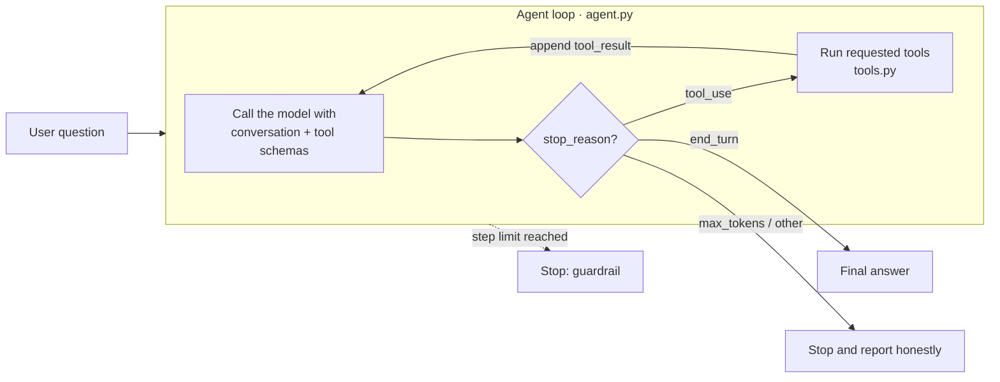

# 🤖 Tool-Using Agent: built from scratch in Python

**An AI agent that decides for itself which tools to call, in what order, until it can answer your question. No agent framework, just a short loop you can read end to end.**

**[▶ Try the live demo](https://agent-demo-ravi-verma.streamlit.app/)** &nbsp;·&nbsp; 

<!-- TODO: record a short GIF of the app (e.g. with ScreenToGif or Kap), save it as docs/demo.gif, then uncomment:

-->

---

## What it does

Ask *"Is it warmer in Tokyo or Sydney right now? By how much?"* and the agent:

1. calls `get_weather("Tokyo")` → live data from Open-Meteo
2. calls `get_weather("Sydney")`
3. calls `calculator("24.1 - 17.3")` to get the exact difference, rather than doing maths in its head
4. answers in plain English

**Nothing in the code tells it to do those steps.** The model plans the sequence at runtime from the tool descriptions, and the UI shows each step as it happens.

## How it works



The model never executes anything itself. It returns a structured request ("call `get_weather` with `city="Tokyo"`"); the loop runs the Python function and sends the result back. That repeats until the model replies **without** requesting a tool (`stop_reason == "end_turn"`), which is how the agent knows it's done.

| File | Responsibility |
|---|---|
| [`agent.py`](agent.py) | The loop: model calls, `stop_reason` handling, step limit, token accounting. Yields an event per step. |
| [`tools.py`](tools.py) | The tools, their JSON schemas, and `execute_tool`, which turns failures into messages the model can read. |
| [`app.py`](app.py) | Streamlit UI: live step-by-step trace, example prompts, per-session limits. |
| [`tests/`](tests) | 31 tests. No API key or network needed. |

## Design decisions

**Why build it without a framework?** To show the mechanism. Frameworks such as LangGraph or the Claude Agent SDK wrap exactly this loop; writing it by hand makes every behaviour below explicit and testable.

**How does it know when to stop?** Three exits, each handled explicitly:
- `end_turn`: the model answered without asking for a tool, so this is the normal finish.
- `max_tokens` or any other reason: returned with a clear "stopped early" note, **not** passed off as a complete answer (an easy bug in naive agent loops).
- `MAX_STEPS` (6): a guardrail against runaway loops that burn money.

**Safe calculator, no `eval()`.** `eval` on internet input would let anyone run Python on the server. The expression is parsed into an AST and only numbers and arithmetic operators are allowed. Huge exponents (`9**9**9`) and over-long inputs are rejected too. The tests include real injection attempts.

**Errors go back to the model, not up the stack.** A bad expression, an unknown city or a weather-API outage becomes a `tool_result` with `is_error: true`. The model reads it and can retry with corrected input, instead of the app crashing.

**Cost control for a public demo.** Every visitor spends the owner's API credit, so:
- a small, fast model (Claude Haiku 4.5) is used;
- visitors get 5 questions per session, each at most 500 characters;
- tool outputs are truncated to 2,000 characters, because the whole conversation is re-sent every step and cost grows with each one;
- token usage is shown under every answer;
- the real backstop is a monthly spend limit set in the Anthropic Console, since session limits can be bypassed by refreshing.

**Testable by design.** `run_agent` accepts any client, so the tests drive the loop with a scripted fake model and check its control flow: multi-step tool use, parallel tool calls, error recovery, the step limit and truncation handling. Open-Meteo is mocked with `httpx.MockTransport`.

## Run it locally

```bash
git clone https://github.com/rverma213/agent-demo.git
cd agent-demo
python -m venv .venv && source .venv/bin/activate   # Windows: .venv\Scripts\activate
pip install -r requirements-dev.txt

cp .streamlit/secrets.toml.example .streamlit/secrets.toml
# edit .streamlit/secrets.toml and add your key from console.anthropic.com

streamlit run app.py            # web UI at http://localhost:8501
pytest                          # run the tests (no key needed)
```

You can also use it from the terminal (needs `ANTHROPIC_API_KEY` set in your environment):

```bash
python agent.py "What's the weather in Paris in Fahrenheit?"
```

## Deploy (free) on Streamlit Community Cloud

1. In the [Anthropic Console](https://console.anthropic.com), create an API key and **set a monthly spend limit**.
2. Push this repo to GitHub. `.streamlit/secrets.toml` is git-ignored, so check it isn't committed.
3. At [share.streamlit.io](https://share.streamlit.io), click **Create app**, then pick this repo and `app.py`.
4. Under **Advanced settings → Secrets**, paste `ANTHROPIC_API_KEY = "sk-ant-..."`.
5. Deploy, then put the URL at the top of this README.

## Tech

Python 3.10+ · [Anthropic API](https://docs.claude.com) (tool use) · [Streamlit](https://streamlit.io) · [Open-Meteo](https://open-meteo.com) (free weather API, no key) · pytest · ruff · GitHub Actions

## What I'd add next

- **v2: MCP.** Move the tools into a [Model Context Protocol](https://modelcontextprotocol.io) server so any MCP client can use them, and the agent can use other people's servers.
- **Evals.** A set of questions with expected tool sequences and answers, run on every prompt or model change.
- **Tracing.** Per-step latency and cost via OpenTelemetry.
- **Memory.** Follow-up questions that refer back to earlier answers.
- **Prompt caching** for the system prompt and tool schemas, to cut the cost of repeated context.
- **Streaming** the final answer token by token.

## License

MIT
